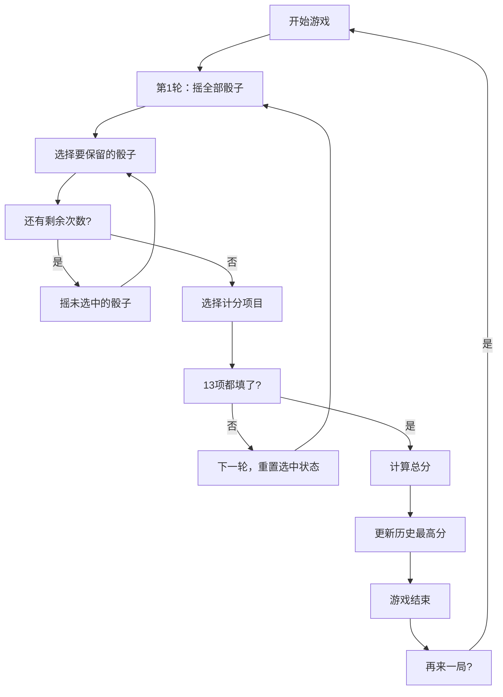

## 1. 产品概述

快艇骰子（Yacht Dice）是一款经典的单人骰子游戏，玩家通过投掷5个骰子并组合出不同的得分模式来获取最高分。游戏运行在浏览器中，无需后端，打开即玩。

- 主要用途：休闲娱乐、策略益智
- 目标用户：喜欢骰子游戏的休闲玩家
- 产品价值：提供随时随地可玩的经典骰子游戏体验

## 2. 核心功能

### 2.1 用户角色

| 角色 | 注册方式 | 核心权限 |
|------|---------|---------|
| 玩家 | 无需注册 | 完整游戏体验、查看历史最高分 |

### 2.2 功能模块

1. **游戏主界面**：Canvas骰子展示区、操作按钮、计分板
2. **骰子交互**：点击选中/取消选中骰子、摇骰子动画
3. **计分系统**：13项计分规则、实时分数计算
4. **游戏状态管理**：回合数管理、游戏结束判定
5. **历史记录**：本地存储最高分

### 2.3 页面详情

| 页面名称 | 模块名称 | 功能描述 |
|---------|---------|----------|
| 游戏主页面 | 骰子展示区 | Canvas绘制5个骰子，支持点击选中/取消 |
| 游戏主页面 | 操作区 | 摇骰子按钮、剩余次数显示、新游戏按钮 |
| 游戏主页面 | 计分板 | 13项得分项目、总分显示、最高分显示 |
| 游戏主页面 | 游戏结束弹窗 | 显示最终得分、历史最高分、再来一局 |

## 3. 核心流程

### 游戏流程

1. 玩家打开页面，游戏自动开始
2. 第1轮：玩家点击"摇骰子"按钮，5个骰子全部随机投掷
3. 玩家可以点击骰子选中（保留不摇）或取消选中
4. 第2、3轮：玩家点击"摇骰子"，未选中的骰子重新投掷
5. 每轮结束后，玩家选择一个计分项目记录分数
6. 13项全部填完后，游戏结束，显示总分
7. 总分与历史最高分比较，更新localStorage

## 4. 用户界面设计

### 4.1 设计风格

- **设计主题**：复古桌游风格，温暖的木质色调搭配米白色骰子
- **主色调**：深木色 #5D4037、米白色 #FAFAFA、金色点缀 #FFD54F
- **辅助色**：选中高亮 #81C784、按钮悬停 #FF8A65
- **按钮风格**：圆角矩形按钮，带轻微阴影和按压效果
- **字体**：使用 Google Fonts 的 "Bungee" 作为标题字体，"Noto Sans SC" 作为正文字体
- **布局风格**：卡片式布局，左侧骰子区，右侧计分板
- **骰子风格**：米白底黑色圆点，带3D立体效果和阴影

### 4.2 页面设计概述

| 页面名称 | 模块名称 | UI元素 |
|---------|---------|--------|
| 游戏主页面 | 骰子展示区 | 5个Canvas骰子、选中状态高亮、悬停效果 |
| 游戏主页面 | 操作区 | 摇骰子按钮（大按钮）、剩余次数徽章、新游戏按钮 |
| 游戏主页面 | 计分板 | 13项得分列表、分数输入、总分卡片、最高分卡片 |
| 游戏主页面 | 游戏结束弹窗 | 半透明遮罩、居中卡片、最终得分、再来一局按钮 |

### 4.3 响应式

- 桌面端优先设计，左右布局
- 移动端自适应为上下布局
- 骰子大小随屏幕宽度自适应
- 触控优化：骰子点击区域足够大（>= 44px）

### 4.4 动画效果

- 骰子摇动动画：快速切换点数模拟摇动
- 选中/取消选中动画：缩放 + 边框颜色变化
- 计分填写动画：数字递增效果
- 按钮悬停/点击效果：颜色变化 + 阴影
- 游戏结束弹窗：淡入 + 缩放出现
