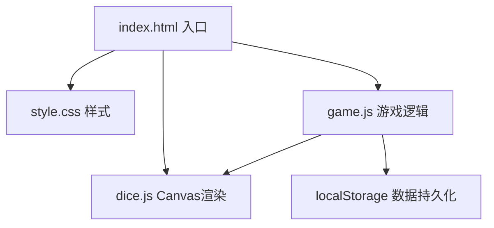

## 1. 架构设计



## 2. 技术说明

- **前端**：纯原生 HTML5 + CSS3 + JavaScript (ES6+)
- **渲染方式**：Canvas 2D API 绘制骰子
- **数据存储**：localStorage 存储历史最高分
- **构建工具**：无，直接打开 index.html 即可运行
- **第三方库**：无，纯原生实现

### 文件结构

```
.
├── index.html      # 主页面HTML结构
├── style.css       # 样式文件
├── game.js         # 游戏核心逻辑
└── dice.js         # Canvas骰子渲染模块
```

## 3. 模块设计

### 3.1 dice.js - 骰子渲染模块

**职责**：负责Canvas骰子的绘制和动画

**核心函数**：
- `DiceRenderer` 类：骰子渲染器
  - `constructor(canvas, size)`：初始化
  - `drawDice(value, selected)`：绘制单个骰子
  - `startRollAnimation(callback)`：开始摇动动画
  - `stopRollAnimation()`：停止动画

### 3.2 game.js - 游戏逻辑模块

**职责**：管理游戏状态、计分规则、回合控制

**核心类**：
- `YachtGame` 类：游戏主控制器
  - `dice`：5个骰子的当前点数
  - `selected`：5个骰子的选中状态
  - `rollsLeft`：当前轮剩余投掷次数
  - `scores`：13项得分记录
  - `currentRound`：当前轮次

**核心方法**：
  - `rollDice()`：投掷未选中的骰子
  - `toggleDice(index)`：切换骰子选中状态
  - `calculateScore(category)`：计算某个项目的得分
  - `recordScore(category)`：记录得分
  - `isGameOver()`：判断游戏是否结束
  - `getTotalScore()`：获取总分
  - `getHighScore()`：获取历史最高分
  - `newGame()`：开始新游戏

## 4. 计分规则定义

### 上半部分（1-6点）
| 项目 | 计分方式 |
|------|---------|
| 1点 | 所有1点的和 |
| 2点 | 所有2点的和 |
| 3点 | 所有3点的和 |
| 4点 | 所有4点的和 |
| 5点 | 所有5点的和 |
| 6点 | 所有6点的和 |

### 下半部分（组合得分）
| 项目 | 条件 | 计分方式 |
|------|------|---------|
| 三条 | 至少3个相同 | 所有点数之和 |
| 四条 | 至少4个相同 | 所有点数之和 |
| 满堂 | 3个相同+2个相同 | 25分 |
| 小顺 | 1-5连续 | 30分 |
| 大顺 | 2-6连续 | 30分 |
| 快艇 | 5个相同 | 50分 |
| 机会 | 任意 | 所有点数之和 |

## 5. 数据模型

### 游戏状态

```javascript
{
  dice: [1, 2, 3, 4, 5],     // 5个骰子的点数
  selected: [false, false, false, false, false], // 选中状态
  rollsLeft: 3,               // 剩余投掷次数
  scores: {
    ones: null,
    twos: null,
    threes: null,
    fours: null,
    fives: null,
    sixes: null,
    threeOfAKind: null,
    fourOfAKind: null,
    fullHouse: null,
    smallStraight: null,
    largeStraight: null,
    yacht: null,
    chance: null
  },
  isFirstRoll: true           // 是否第一轮
}
```

### localStorage 数据

```javascript
{
  yachtHighScore: 300  // 历史最高分
}
```

## 6. 事件处理

| 事件 | 处理函数 | 说明 |
|------|---------|------|
| 骰子点击 | `handleDiceClick(index)` | 切换选中状态 |
| 摇骰子按钮点击 | `handleRollClick()` | 投掷未选中的骰子 |
| 计分项目点击 | `handleScoreClick(category)` | 记录该项目得分 |
| 新游戏按钮点击 | `handleNewGame()` | 重置游戏 |
